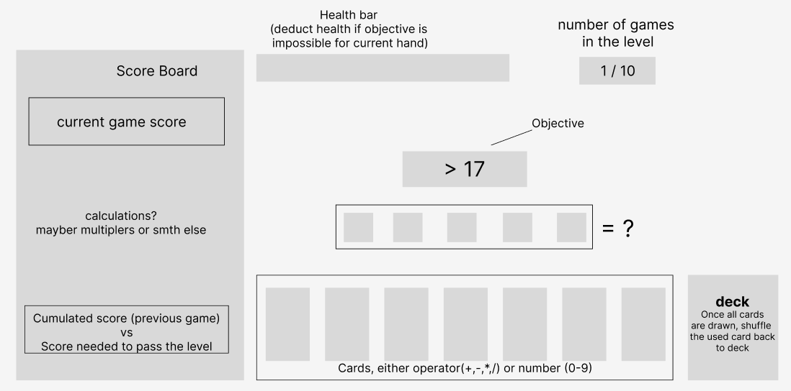

# Game Design Document

## Simple  Game Loop

A player has **cards**, which are representations of both numbers and operators (*see: Card Examples*). Each **round** of a **game**, the player is given a constraint, which changes what cards are best played (*see: Constraint Examples*). How well the player creates the solutions determines their points, with each game having a point threshold to win (__**To Be Discussed**__). The player creates these solutions via the cards in their **hand**, which promotes creativity and problem solving. Some constraints will require special cards to appear in the players hand (like, for instance, a constraint using variables needs the player to be able to use variables).

### Card Examples 

*Note: All of the operators listed here are in their ascii form, when in the game, more complex symbols, like you'd find on calculators, should be used on the cards*

- `7` - my first thought is we allow all the digits up to 12, as that is the limit for commonly taught multiplication 
- `*`
- `^`
- `x` - some constraints will have mandatory cards, which will be required to be shown in the users' hand

### Constraint Examples

- `> 5` (play a number that is greater than five, easy) 
- `= 37` (make an equation that equals 37, medium)
- `x = 3` (make an equation that has `x` in it that solves to `x = 3`, medium)
- `x = 1, x = -1` (make a equation that has `x` terms such that both solutions are correct, hard)

### GUI Mockups

## Broader Game Loop 

The larger game loop involves moving the player between the games described in the simple game loop section. This is currently to be discussed, whether we want to have a leveling system (like a lesson plan), something around multiplayer, or anything else, but we should focus on the simple game loop beforehand.
