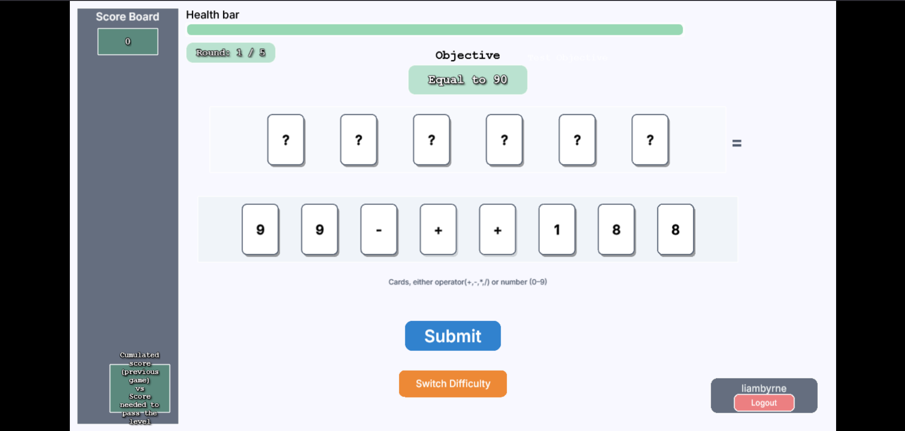

# Mathatro
Mathatro aims to provide an educational while entertaining way for students to learn math. Through interaction with numbers and operators, students will be more familiar with the math concepts.

## About the project

The game uses a deck of playing cards with numbers and operators. To progress, the player must combine these cards to meet the objective of each level — for example, “>17” or “<9”. The aim is to beat all 10 levels and achieve the highest score possible.

There are multiple difficulty tiers - Easy, Medium or Hard. Each offers unique increases in both difficulty and fun. Difficuly can affect the range of possible objective solution numbers, the types of mathematical operators provided on cards, and the number of rounds per game.

Whether you’re a math whiz or someone who finds math challenging, you’re bound to have some fun!!!

By Team SOFTGEN 310 Group 99.75  
This project is associated with the University of Auckland – SOFTENG 310

## Key features
- Login and authentication capabilities
- Randomly generated game objectives
- Correctness checker to ensure the objectives are always completeable
- Health bar which depletes on incorrect answers, to encourage focus on correct answers
- Multiple difficulty game tiers for all user skill levels
- Concise ingame instruction set for new users
- Clean, user friendly design and UI on all pages
- Clear documentation and contributor processes

## Built With
- [Node.js](https://nodejs.org/) – JavaScript runtime  
- [Phaser](https://phaser.io) - Game framework
- [Firebase](https://firebase.google.com) - Authentication storage

## Running Locally
1. First ensure Node.js is installed on your machine: run `npm --version` on command line prompt. If not installed, check out relevant website for instruction.
2. If running it for first time, install dependencies with `npm install`.
3. Once installed, start the development server with `npm run dev`.
4. If you want to build the project, run `npm run build`.

## Testing
1. Make sure you are in the `\PhaserGame` directory.
2. This also requires Node.js and its dependencies, run `npm install`.
3. Once installed, run the test suite using `npm test`.
4. To add more tests, navigate to `\PhaserGame\test` and add to existing files or create new files depending on test category.

## Contributing
Ensure that all contributions follow the code of conduct and correct workflow. All issues and pull requests should be made using the correct templates and should be tagged with the correct labels. Merging pull requests requires passing automated snyk and sonar checks, as well as a code review from at least 1 other contributor.

## Versions and releases
This project uses Git for versioning. There are no specific github releases tracked, but the major milestones for the project were
- A1: Current version main branch on 25th August 2025
- A2: Current version main branch on 17th October 2025

See [Contributor Guideline](https://github.com/SOFTGEN310-Group-99-75/JOhn-Repository/blob/main/CONTRIBUTING.md) for more detail 

## License
This project is licensed under the GNU Affero General Public License v3.0 (AGPL-3.0). See [LICENSE](https://github.com/SOFTGEN310-Group-99-75/JOhn-Repository/blob/main/LICENSE) for full terms.
